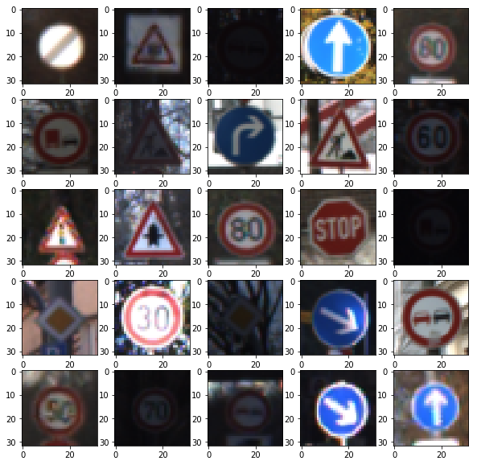
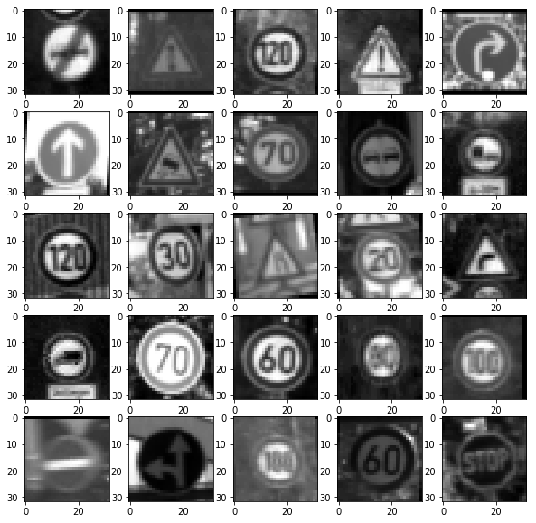
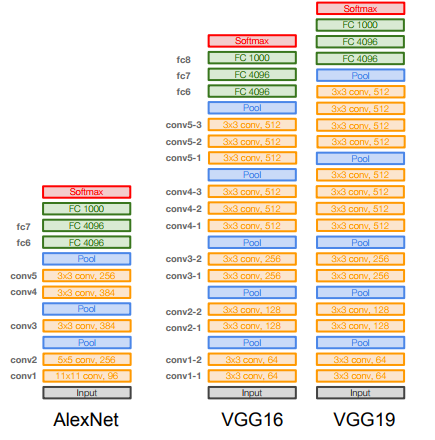
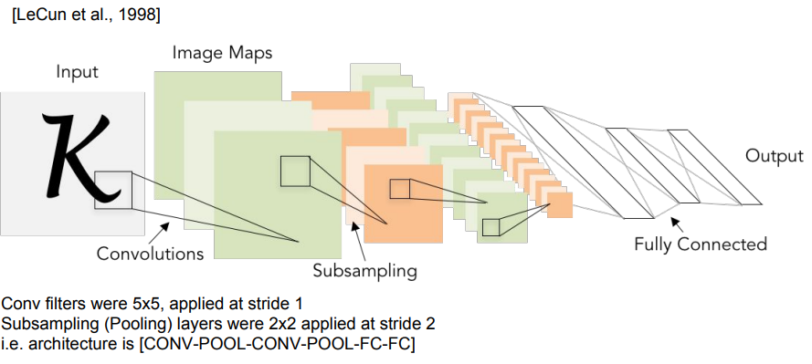
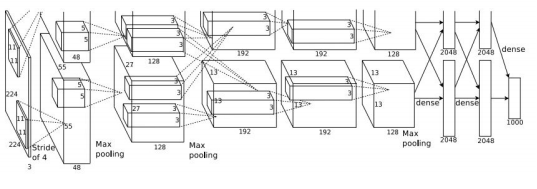

# Project Walkthrough

The steps of this project are the following:
* Load the data set
* Explore, summarize and visualize the data set
* Design, train and test a model architecture
* Use the model to make predictions on new images
* Analyze the softmax probabilities of the new images
* Summarize the results 
Steps can be found in the Ipython Notebook.
---

## Data Set Summary & Exploration

### 1.Basic Summary of the Data Set. 

I used the numpy library to calculate summary statistics of the traffic signs data set:

* The size of training set is 34799
* The size of the validation set is 4410
* The size of test set is 12630
* The shape of a traffic sign image is 32x32x3
* The number of unique classes/labels in the data set is 43

### 2. Exploratory Visualization of the Dataset.

Here is an exploratory visualization of the data set. 

First I sampled 25 images from the training set. I learned that it is hard to classify some of the images even by human eyes. 



Then I explored the class distribution in each set. It is noted that class distribution is not uniform, meaning some classes
have more data. 


### 3. Design and Test a Model Architecture

#### 1. Preprocessed the image data. 

* Balancing Dataset and Data Augmentation:

When exploring the dataset, it was noted that some classes have more dataset than other. This could lead to a poor model. For example,
if training dataset consists of 90% class 1 data, and 10% class 2 data. Model would very likely to always predict class 1, and it would
still yield a 90% accuracy. However it is not a good model for prediction. Therefore training data were balanced in order to train a 
more optimal model.

The class distribution looked like this after balancing:


After obtaining even distributed training dataset. Data augmentation was performed. [Image Augmentation Library](https://github.com/aleju/imgaug) was used.

For each image in the balanced training set, 20 new images were generated: 
- 5 of them were sheared by -5 to 5 degrees, 
- 5 of them were translated in the x and/or y direction with 7 degrees, 
- 5 of them were scaled by -10 to +10 percent, 
- and rest of them were roated by -15 to 15 degrees.

Images generated by them could still be recognized as traffic signs. Flipping images or rotating images by 90 degrees would not be good
augementation method for this application, as traffic signs are rarely presented like that in the real life.

The final training dataset has the size of 164367.

* Grayscale

The next step was to convert RGB images to grayscale. In this way, the features were compressed while reserving important information.
Belows are the sample images after converting to grayscale.



* Normalization 

Finally, images were normalized, so that the minimum, and maximum values of each dataset were 0, and 255.
Belows are them sample images after normalization.


#### 2. Final model architecture description

Final model architecture for this application was developed by mimicking VGGNet.
The architecture of VGGNet used developed for the Large Scale Visual Recognition Challenge is shown below:

[source](http://cs231n.stanford.edu/slides/2017/cs231n_2017_lecture9.pdf)

The detial architecture of model designed for this project is described in the table below:

|Layers|Properties|
|:-------|:-----------|
|conv| 6 3x3 filters with stride of 1; padding of size 1|
|relu| Activation|
|conv| 6 3x3 filters with stride of 1; padding of size 1|
|relu| Activation|
|conv| 6 3x3 filters with stride of 1; padding of size 1|
|relu| Activation|
|pool| Max Pooling, 2x2 filter with stride of 1; no padding| 
|conv| 16 3x3 filters with stride of 1; padding of size 1|
|relu| Activation|
|conv| 16 3x3 filters with stride of 1; padding of size 1|
|relu| Activation|
|conv| 16 3x3 filters with stride of 1; padding of size 1|
|relu| Activation|
|pool| Max Pooling, 2x2 filter with stride of 1; no padding| 
|fc| fully connected layers, output 256 hidden layers|
|relu| Activation|
|fc| fully connected layers, output 64 hidden layers|
|relu| Activation|
|classifier| 43 class classifier|


#### 3. Training. 
To train the model, I used backpropagation to find the gradient of model parameters. Mini-batch stochastic gradient descent was used
to find model parameters that yield the optimal perfomrance. Batch size 128, learning rate of 0.001, and 10 epochs were used for 
training. To avoid overfitting 50% drop out rate was used.

```
EPOCHS = 10
BATCH_SIZE = 128
rate = 0.001
drop_out = 0.5
```

#### 4. Describe the approach taken for finding a solution and getting the validation set accuracy to be at least 0.93. 
The results on the training, validation and test sets of my final model are:
* training set accuracy of 99.8%
* validation set accuracy of 97.3%
* test set accuracy of 95.5%

VGGNet was chosen because it was relatively easy to implement while providing accurate predition. It showed a high accuracy in the 2014 
Large Scale Visual Recognition Challenge. Therefore I believed that it would also work very well on the traffic sign application. 
The original VGG was developed to classified images of 1000 different labels, therefore it had a very deep architecture. But traffic 
signs share many similarities among themselves, so the traffic sign application wouldn't require as many layers and as many filters in 
each convolutional layer. My final model only included 6 convolutional layers.
I chose VGGNets, also because of less parameters required. "Stack of three 3x3 conv (stride 1) layers has same effective receptive field 
as one 7x7 conv layer." Three 3x3 conv layer has less parameters to train than a 7x7 conv layer. Beside efficiency, three conv layers 
provide more non-linearities, which helps to improve model accuracy.
Dropout was implemented to the model after finding training accuracy were consistantly around 5% higher than validation accuracy. I
anticipated that model was overfitted, so I added 50% dropout rate in the full connected layers. With dropout, validation accuracy was 
increased.


Two other architectures were evaluated besides VGGNet: They are LeNet and AlexNet. 
Training accuracy of LeNet stopped improving around 93% even with augmented data, so I concluded that a model with deeper layers were 
needed. 
The first AlexNet(see table below) trained yielded a similar accuracy as LeNet. To improve the accuracy, I first decreased the filter
size. Turned out theaccuracy was not improved by doing so. Then I tried increasing the filter depth instead. The third AlexNet yielded a
test accuracy around 95%, however it required more parameters than VGGNet. Thus VGGNet was chosen as final model instead.

See model description below:

**LeNet:**

[source](http://cs231n.stanford.edu/slides/2017/cs231n_2017_lecture9.pdf)

**Architecture Summary**

|Layers| Properties |
|:-------|:-----------|
|conv| 6 5x5 filters with stride of 1; no padding
|relu| Activation
|pool| Max Pooling, 2x2 filter with stride of 1; no padding
|conv| 16 5x5 filters with stride of 1; no padding
|relu| Activation
|pool| Max Pooling, 2x2 filter with stride of 1; no padding
|fc| fully connected layers, output 120 hidden layers
|relu| Activation
|fc| fully connected layers, output 84 hidden layers
|relu| Activation
|classifier| 43 class classifier

**AlexNet**

[source](http://cs231n.stanford.edu/slides/2017/cs231n_2017_lecture9.pdf)

**Architecture Summary**

|Layers|AlexNet_1 Properties|AlexNet_2 Properties|AlexNet_3 Properties|
|:-------|:-----------|:-------|:-----------|
|conv| 6 5x5 filters with stride of 1; no padding| 6 5x5 filters with stride of 1; padding of size 2| 16 5x5 filters with stride of 1; no padding|
|relu| Activation| Activation| Activation|
|pool| Max Pooling, 2x2 filter with stride of 1; no padding| Max Pooling, 2x2 filter with stride of 1; no padding| Max Pooling, 2x2 filter with stride of 1; no padding|
|conv| 16 5x5 filters with stride of 1; no padding| 16 5x5 filters with stride of 1; padding of size 2| 32 5x5 filters with stride of 1; no padding|
|relu| Activation| Activation| Activation|
|pool| Max Pooling, 2x2 filter with stride of 1; no padding| Max Pooling, 2x2 filter with stride of 1; no padding| Max Pooling, 2x2 filter with stride of 1; no padding|
|conv| 32 3x3 filters with stride of 1; padding of size 1| 32 3x3 filters with stride of 1; padding of size 1| 64 3x3 filters with stride of 1; padding of size 1|
|relu| Activation| Activation| Activation|
|conv| 32 3x3 filters with stride of 1; padding of size 1| 32 3x3 filters with stride of 1; padding of size 1| 64 3x3 filters with stride of 1; padding of size 1|
|relu| Activation| Activation| Activation|
|conv| 16 3x3 filters with stride of 1; padding of size 1| 16 3x3 filters with stride of 1; padding of size 1| 32 3x3 filters with stride of 1; padding of size 1|
|relu| Activation| Activation| Activation|
|fc| fully connected layers, output 120 hidden layers| fully connected layers, output 256 hidden layers| fully connected layers, output 200 hidden layers|
|relu| Activation| Activation| Activation|
|fc| fully connected layers, output 84 hidden layers| fully connected layers, output 128 hidden layers| fully connected layers, output 84 hidden layers|
|relu| Activation| Activation| Activation|
|classifier| 43 class classifier| 43 class classifier| 43 class classifier|

---
## Test a Model on New Images

### 1. Five German traffic signs found on the web. 
Here are five German traffic signs that I found on the web:


All five images showed the traffic sign very clear, so I expected a 100% accuracy returned by the model.

### 2. Model's predictions on new traffic signs.

Here are the results of the prediction:

| Image			        |     Prediction	        					| 
|:---------------------:|:---------------------------------------------:| 
| Right-of-way at the next intersection | Right-of-way at the next intersection | 
| Road work | Road work |
| Speed limit (60km/h) | Speed limit (60km/h) |
| Stop | Stop |
| Yield | Yield |


The model was able to correctly guess 5 of the 5 traffic signs, which gives an accuracy of 100%. 

### 3. Describe how certain the model is when predicting on each of the five new images by looking at the softmax probabilities for each prediction. 
The top 5 softmax probabilities for each image along with the sign type of each probability. 

For the first image, model is very certain that it is a right-of-way at the next intersection sign.

| Probability         	|     Prediction	        					| 
|:---------------------:|:---------------------------------------------:| 
| 1.0|Right-of-way at the next intersection| 
| .00|Beware of ice/snow|
| .00|Pedestrians|
| .00|General caution|
| .00|Priority road|

For the second image, the model is very certain that it is a road work sign.

| Probability         	|     Prediction	        					| 
|:---------------------:|:---------------------------------------------:| 
|1.0|Road work|
|.00|Bumpy road|
|.00|Beware of ice/snow|
|.00|Bicycles crossing|
|.00|General caution|


For the third image, the model is 90% certain that it is a 60km/h speed limit sign. And it is abut 10% certain it's a 80 km/h speed limit sign. The possibilities returned by the model showed the model works as expected since both signs do look very alike.

| Probability         	|     Prediction	        					| 
|:---------------------:|:---------------------------------------------:| 
|.90|Speed limit (60km/h)|
|.10|Speed limit (80km/h)| 
|.00|Speed limit (20km/h)|
|.00|End of speed limit (80km/h)|
|.00|ehicles over 3.5 metric tons prohibited|

For the forth image, the model is very certain that it is a stop sign.

| Probability         	|     Prediction	        					| 
|:---------------------:|:---------------------------------------------:| 
|1.0|Stop|
|.00|Turn left ahead|
|.00|No entry|
|.00|Roundabout mandatory|
|.00|Turn right ahead|

For the last image, the odel is very certain that it is a yield sign.

| Probability         	|     Prediction	        					| 
|:---------------------:|:---------------------------------------------:| 
|1.0|Yield|
|.00|Speed limit (80km/h)|
|.00|Speed limit (50km/h)|
|.00|No vehicles|
|.00|Go straight or right|
